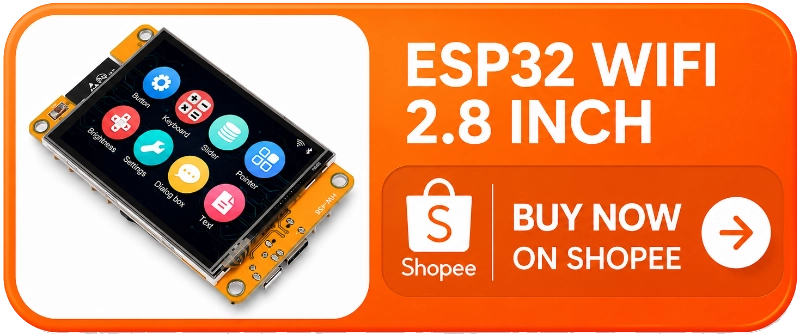
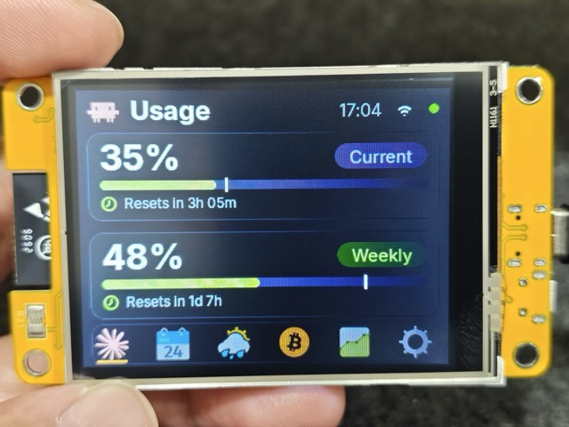
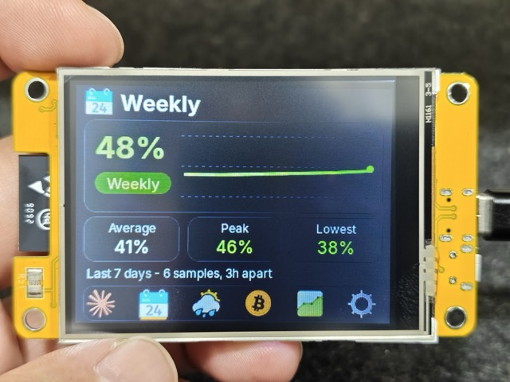
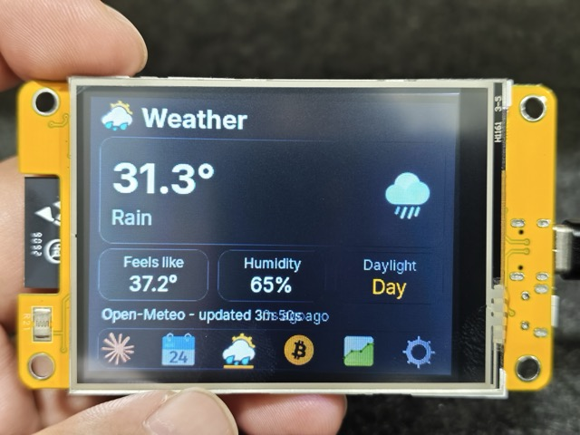
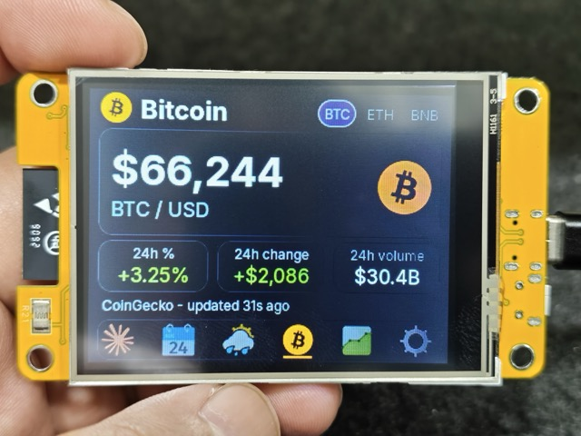
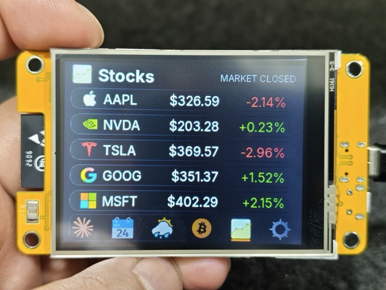
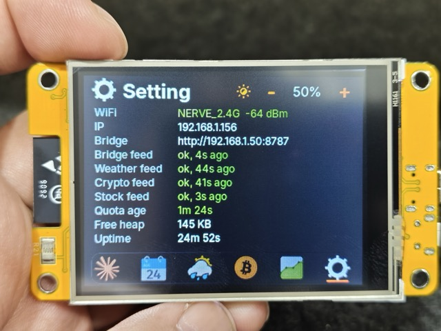
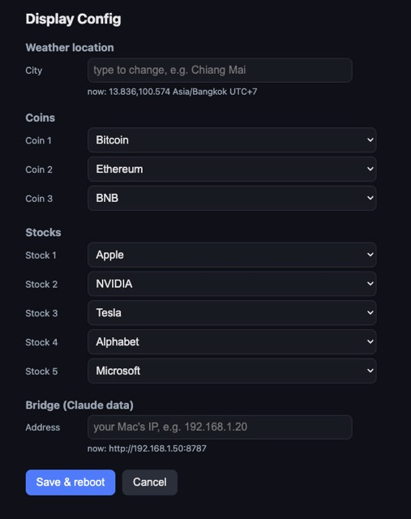
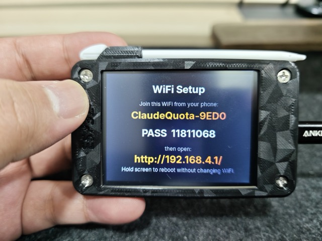

# Claude quota monitor — ESP32-2432S028R

<p align="center">
  <b>🇬🇧 English</b> &nbsp;·&nbsp; <a href="README.th.md">🇹🇭 ภาษาไทย</a>
</p>

<p align="center"><b>💸 Zero Claude tokens — watching your quota never spends it.</b></p>

<p align="center">
  <a href="https://s.shopee.co.th/9fJTGEoal1"></a>
</p>

A desk display for Claude Code's two usage windows, plus weather, crypto and
stocks. Runs on the "Cheap Yellow Display" (ESP32-2432S028R, 2.8" touch), drawn
with LVGL 9. The numbers come from the same read-only endpoint the claude.ai web
app uses — no prompt, no model call, no hit to your rate-limit windows.

| Screen | Shows |
|---|---|
| **Claude** | Session and Weekly utilization, with live reset countdowns |
| **Weekly Usage** | The last seven days of weekly utilization, plotted |
| **Weather** | Temperature, apparent temperature, conditions, humidity |
| **Crypto** | One coin's price, 24h change, dollar move and volume |
| **Stock** | Five tickers, with a market-open badge |
| **Setting** | Link and feed health, backlight, Config Mode |

<table>
  <tr>
    <td align="center"><br><b>Claude</b></td>
    <td align="center"><br><b>Weekly Usage</b></td>
    <td align="center"><br><b>Weather</b></td>
  </tr>
  <tr>
    <td align="center"><br><b>Crypto</b></td>
    <td align="center"><br><b>Stock</b></td>
    <td align="center"><br><b>Setting</b></td>
  </tr>
</table>

## What you need

| Item | Notes |
|---|---|
| **ESP32-2432S028R** board | The 2.8" single-USB "CYD". ~$10. [Buy on Shopee (TH)](https://s.shopee.co.th/9fJTGEoal1). |
| **USB data cable** | Micro-USB — a charge-only cable looks like a dead board. |
| **A computer running Claude Code** | Source of the quota numbers. Stays awake, same LAN as the display. |
| **A claude.ai session key** | Pasted into a file in step 3. |
| **PlatformIO Core** | `pip install -U platformio` — lands at `~/.local/bin/pio`. |

Windows also needs the [CH340 driver](https://www.wch-ic.com/downloads/CH341SER_EXE.html)
(built into macOS 12+/Linux). No soldering, no extra parts.

## 1. Clone and configure

```bash
git clone https://github.com/thaitop/esp32-claude-quota.git
cd esp32-claude-quota
cp firmware/src/secrets.h.example firmware/src/secrets.h
```

Edit `firmware/src/secrets.h`:

```c
#define WIFI_SSID     "your-network"        // 2.4GHz only
#define WIFI_PASSWORD "your-password"
#define BRIDGE_BASE_URL "http://192.168.1.117:8787"   // LAN IP of the Claude Code machine
#define WEATHER_LATITUDE  13.75f
#define WEATHER_LONGITUDE 100.50f
#define WEATHER_TZ "Asia/Bangkok"           // IANA zone name
#define CLOCK_TZ   "UTC+7"                   // header clock offset
#define FINNHUB_TOKEN "your-finnhub-token"  // free key from finnhub.io/register — Stock screen only
```

Get the machine's IP with `ipconfig getifaddr en0` (macOS) or `hostname -I`
(Linux). The Finnhub token is optional — leaving the placeholder just shows `--`
on the Stock screen. Weather, coins and stocks can also be changed on the device
later via [Config Mode](#config-mode), and the **WiFi** via
[WiFi Setup](#wifi-setup) — both without a reflash. The values here are the
factory defaults the first boot uses; once changed on the device they live in
NVS and editing this file changes nothing until a fresh flash.

## 2. Flash

```bash
cd firmware
~/.local/bin/pio run --target upload > /tmp/upload.log 2>&1; echo "exit=$?"
grep -E "Hash of data|Hard resetting|SUCCESS|FAILED" /tmp/upload.log
```

First build pulls the toolchain (a few minutes); later builds ~1 min. Then watch
it boot:

```bash
~/.local/bin/pio device monitor
```

Weather and Crypto work as soon as WiFi is up; the two Claude screens stay at
`--` until the bridge is running (steps 3–4).

## 3. Set up the quota source

Give `fetch_usage.py` a claude.ai session key:

```bash
mkdir -p ~/.config/claude-quota
pbpaste > ~/.config/claude-quota/session-key   # or paste into an editor
chmod 600 ~/.config/claude-quota/session-key
```

The value is the `sessionKey` cookie from a browser logged in to claude.ai — it
starts with `sk-ant-sid01-`. Treat it like your password.

<details>
<summary><b>How to find the session key</b></summary>

1. Open [claude.ai](https://claude.ai) in a browser and sign in.
2. Open Developer Tools (`F12`, or `Cmd+Option+I` on macOS). In Safari, first
   enable Settings → Advanced → *Show features for web developers*.
3. Go to the cookies:
   - Chrome / Edge / Brave: **Application** tab → **Cookies** → `https://claude.ai`
   - Firefox / Safari: **Storage** tab → **Cookies** → `https://claude.ai`
4. Copy the **Value** of the cookie named `sessionKey` into the key file above.

</details>

Then start the fetcher:

```bash
python3 bridge/fetch_usage.py --check    # verify paths/permissions
python3 bridge/fetch_usage.py --interval # loop on a 60s timer
```

Use a Python with a working TLS trust store — Homebrew's, not the python.org
build. Pass `--org-id` if you belong to more than one organization.

## 4. Start the bridge

```bash
python3 bridge/quota_bridge.py
# → http://0.0.0.0:8787/quota
```

Check it:

```bash
curl -s http://localhost:8787/quota | python3 -m json.tool
```

If a check from a phone or another laptop hangs, allow the Python binary through
the host firewall (macOS: System Settings → Network → Firewall).

## 5. Keep both processes running (optional)

To survive reboots, install two `launchd` jobs — one for the fetcher, one for
the bridge. Ready-made plists live in `bridge/launchd/`:

```bash
cp bridge/launchd/com.local.claude-quota-fetch.plist.example \
   ~/Library/LaunchAgents/com.local.claude-quota-fetch.plist
cp bridge/launchd/com.local.claude-quota-bridge.plist.example \
   ~/Library/LaunchAgents/com.local.claude-quota-bridge.plist

# rewrite the placeholder path to your real repo (run from the repo root)
sed -i '' "s#/Users/you/esp32-claude-quota#$PWD#" \
  ~/Library/LaunchAgents/com.local.claude-quota-{fetch,bridge}.plist

launchctl load ~/Library/LaunchAgents/com.local.claude-quota-fetch.plist
launchctl load ~/Library/LaunchAgents/com.local.claude-quota-bridge.plist
launchctl list | grep claude-quota    # second column is the last exit code (0 = ok)
```

An expired key does not kill the fetcher — paste a fresh one into the key file
and the display recovers within one interval, no restart. Linux: a user systemd
unit with `Restart=always`. Windows: Task Scheduler at logon.

## Touch controls

| Gesture | Effect |
|---|---|
| Tap a navbar Slot | Switch Screen |
| Tap above the navbar | Force an immediate refresh |
| Hold ~1s above the navbar | Blank the display (tap to wake) |

## Config Mode

Change the weather location, coins and stocks from a browser — no reflash.

**Hold the Config button** on the Setting screen. The panel shows an address and
a four-digit **PIN**. Open the address on a phone or laptop on the same LAN,
enter the PIN, pick your city / coins / stocks, then **Save & reboot**. To leave
without a browser, hold a press anywhere on the panel to exit unsaved.

<p align="center">
  
</p>

## WiFi Setup

Change the network the display joins — no reflash.

It opens two ways:

- **Automatically**, when it can't join the saved network at boot (network gone,
  wrong password, a board flashed with placeholder creds).
- **On demand** — hold a finger on the screen while the device powers up (keep
  holding ~1s after boot).

The panel then shows an access point name (`ClaudeQuota-XXXX`), a **password**,
and a URL. Join that WiFi from a phone, open `http://192.168.4.1/`, pick or type
your network and password, then **Save & reboot** — the device joins the new
network. Hold the screen to reboot without changing anything.

<p align="center">
  
</p>

## Colour thresholds

| Utilization | Colour |
|---|---|
| < 60% | green |
| 60–84% | amber |
| ≥ 85% | red |

## Troubleshooting

- **Upload won't connect** (`No serial data received`). Hold BOOT while it
  starts. No port under `pio device list` → cable or CH340 driver.
- **Upload dies mid-transfer.** Lower `upload_speed` to 115200 in `platformio.ini`.
- **Blank display, serial active.** Backlight pin — other CYD revisions use
  GPIO27; change `-DTFT_BL=21`.
- **Colours inverted.** Swap `-DILI9341_2_DRIVER=1` for `-DILI9341_DRIVER=1`.
- **Touches off-centre.** Replace the four `TOUCH_RAW_*` constants in `config.h`.
- **WiFi never joins.** 2.4GHz only; captive-portal networks won't work. A
  device that can't join drops into [WiFi Setup](#wifi-setup) (its own access
  point) so you can point it at another network without a reflash.
- **Serial monitor prints garbage.** Baud mismatch — run `pio device monitor`
  from the `firmware/` directory so it reads `monitor_speed = 115200`, or pass
  `-b 115200`.
- **Any figure shows `--`.** The value is not trustworthy, not zero. The Setting
  screen names the failing feed.
- **Only Claude screens `--`, bridge fine.** Nearly always an expired session
  key. Paste a fresh one; it recovers next pass.
- **Editing `include/lv_conf.h` changes nothing.** Run `pio run -t clean` first.

## Security notes

The `sessionKey` cookie is a **full account credential**, not a scoped API key.
It lives in `~/.config/claude-quota/session-key` (mode 600, outside the repo) and
is never logged or put in a plist. The bridge serves on the LAN with no auth
(percentages only, no credentials) — bind it to a trusted network, don't
port-forward. The ESP32 stores WiFi credentials in plaintext (in NVS once
[WiFi Setup](#wifi-setup) has written them), so treat a board you give away as
one you gave your WiFi password to — erase its flash first. WiFi Setup's own
access point is WPA2-protected with an 8-digit password shown only on the panel,
so the home password typed into its form never crosses an open link.
