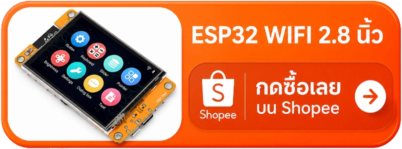

# จอมอนิเตอร์โควตา Claude — ESP32-2432S028R

<p align="center">
  <a href="README.md">🇬🇧 English</a> &nbsp;·&nbsp; <b>🇹🇭 ภาษาไทย</b>
</p>

<p align="center"><b>💸 ไม่กิน Claude token เลย — ติดตามดูโควตาแบบไม่เปลืองโควตา</b></p>
<p align="center">🍎 <b>สร้างและทดสอบบน macOS</b> ส่วน Windows ยังไม่ทดสอบ (path, คลิปบอร์ด และกลไกรันค้างต่างกันหมด)</p>

<p align="center">
  <a href="https://s.shopee.co.th/9fJTGEoal1"></a>
</p>

จอตั้งโต๊ะที่คอยแสดงหน้าต่าง rate-limit ทั้งสองช่วงของ Claude Code พร้อมข้อมูล
อากาศ คริปโต และหุ้น รันบน "Cheap Yellow Display" (ESP32-2432S028R จอทัช 2.8")
วาดด้วย LVGL 9 ตัวเลขมาจาก endpoint แบบอ่านอย่างเดียวตัวเดียวกับที่เว็บแอป
claude.ai ใช้ จึงไม่มี prompt ไม่เรียกโมเดล และไม่กระทบหน้าต่าง rate-limit เลย

| หน้าจอ | แสดง |
|---|---|
| **Claude** | Utilization ของ Session และ Weekly พร้อมนับถอยหลังจนรีเซ็ต |
| **Weekly Usage** | Utilization รายสัปดาห์ย้อนหลังเจ็ดวัน เป็นกราฟ |
| **Weather** | อุณหภูมิ อุณหภูมิที่รู้สึก สภาพอากาศ ความชื้น |
| **Crypto** | ราคาเหรียญ การเปลี่ยนแปลง 24 ชม. มูลค่าและปริมาณ |
| **Stock** | ห้าตัวเป็นลิสต์ พร้อม badge บอกว่าตลาดเปิดหรือปิด |
| **Setting** | สถานะลิงก์และแต่ละ feed ความสว่าง Config Mode |

<table>
  <tr>
    <td align="center"><br><b>Claude</b></td>
    <td align="center"><br><b>Weekly Usage</b></td>
    <td align="center"><br><b>Weather</b></td>
  </tr>
  <tr>
    <td align="center"><br><b>Crypto</b></td>
    <td align="center"><br><b>Stock</b></td>
    <td align="center"><br><b>Setting</b></td>
  </tr>
</table>

## สิ่งที่ต้องมี

| รายการ | หมายเหตุ |
|---|---|
| **บอร์ด ESP32-2432S028R** | "CYD" ขนาด 2.8" USB เดี่ยว ราคาราว $10 [ซื้อบน Shopee](https://s.shopee.co.th/9fJTGEoal1) |
| **สาย USB แบบส่งข้อมูล** | Micro-USB — สายชาร์จอย่างเดียวจะดูเหมือนบอร์ดเสีย |
| **เครื่องที่รัน Claude Code** | แหล่งของตัวเลขโควตา ต้องเปิดค้างและอยู่ LAN เดียวกับจอ |
| **session key ของ claude.ai** | วางลงไฟล์ในขั้น 3 |
| **PlatformIO Core** | `pip install -U platformio` — ติดตั้งที่ `~/.local/bin/pio` |

Windows ต้องลง [ไดรเวอร์ CH340](https://www.wch-ic.com/downloads/CH341SER_EXE.html)
ด้วย (macOS 12+/Linux มีมาให้แล้ว) ไม่ต้องบัดกรี ไม่ต้องมีชิ้นส่วนเพิ่ม

> [!NOTE]
> **คู่มือนี้เขียนและทดสอบบน macOS** คำสั่งด้านล่างอิงมาจากของ macOS —
> `pbpaste`, `ipconfig getifaddr en0`, `launchd` และ path `~/.local/bin/pio`
> ตรงไหนที่ Linux ต่างออกไปมีบอกไว้ในบรรทัดนั้น ๆ **ยังไม่ได้ทดสอบบน Windows:**
> ทั้ง path ของไฟล์ คำสั่งคลิปบอร์ด และกลไกการทำงานเบื้องหลัง (Windows ใช้ Task Scheduler
> ไม่ใช่ `launchd`) ต่างกันหมด ให้ถือว่าขั้นตอนฝั่ง Windows เป็นแนวทางคร่าว ๆ
> ไม่ใช่สูตรที่สามารถก็อบวางได้เลย

## 1. Clone และตั้งค่า

```bash
git clone https://github.com/thaitop/esp32-claude-quota.git
cd esp32-claude-quota
cp firmware/src/secrets.h.example firmware/src/secrets.h
```

แก้ `firmware/src/secrets.h`:

```c
#define WIFI_SSID     "your-network"        // 2.4GHz เท่านั้น
#define WIFI_PASSWORD "your-password"
#define BRIDGE_BASE_URL "http://192.168.1.117:8787"   // IP บน LAN ของเครื่องที่รัน Claude Code
#define WEATHER_LATITUDE  13.75f
#define WEATHER_LONGITUDE 100.50f
#define WEATHER_TZ "Asia/Bangkok"           // ชื่อโซนแบบ IANA
#define CLOCK_TZ   "UTC+7"                   // ออฟเซ็ตนาฬิกาบนหัวจอ
#define FINNHUB_TOKEN "your-finnhub-token"  // คีย์ฟรีจาก finnhub.io/register — ใช้เฉพาะหน้า Stock
```

หา IP ของเครื่องได้ด้วย `ipconfig getifaddr en0` (macOS) หรือ `hostname -I`
(Linux) Finnhub token เป็นตัวเลือก — ถ้าปล่อย placeholder ไว้ หน้า Stock จะขึ้น
`--` ค่าตำแหน่งอากาศ เหรียญ และหุ้น แก้บนเครื่องทีหลังผ่าน
[Config Mode](#config-mode) ได้โดยไม่ต้องแฟลชใหม่

## 2. แฟลช

```bash
cd firmware
~/.local/bin/pio run --target upload > /tmp/upload.log 2>&1; echo "exit=$?"
grep -E "Hash of data|Hard resetting|SUCCESS|FAILED" /tmp/upload.log
```

Build แรกต้องดึง toolchain (กินเวลาไม่กี่นาที) build ถัดไปราว 1 นาที จากนั้นดูมัน
บูต:

```bash
~/.local/bin/pio device monitor
```

Weather กับ Crypto ทำงานทันทีที่ WiFi ขึ้น ส่วนสองหน้า Claude จะค้างที่ `--`
จนกว่า bridge จะรัน (ขั้น 3–4)

## 3. ตั้งค่าแหล่งโควตา

ป้อน session key ของ claude.ai ให้ `fetch_usage.py`:

```bash
mkdir -p ~/.config/claude-quota
pbpaste > ~/.config/claude-quota/session-key   # หรือวางในโปรแกรมแก้ไขข้อความ
chmod 600 ~/.config/claude-quota/session-key
```

ค่านั้นคือคุกกี้ `sessionKey` จากเบราว์เซอร์ที่ล็อกอิน claude.ai อยู่ ขึ้นต้น
ด้วย `sk-ant-sid01-` ดูแลมันเหมือนรหัสผ่าน

<details>
<summary><b>ขั้นตอนการหา session key</b></summary>

1. เปิด [claude.ai](https://claude.ai) ในเบราว์เซอร์แล้วลงชื่อเข้าใช้
2. เปิด Developer Tools (`F12` หรือ `Cmd+Option+I` บน macOS) ใน Safari ต้องเปิด
   ที่ Settings → Advanced → *Show features for web developers* ก่อน
3. ไปที่คุกกี้:
   - Chrome / Edge / Brave: แท็บ **Application** → **Cookies** → `https://claude.ai`
   - Firefox / Safari: แท็บ **Storage** → **Cookies** → `https://claude.ai`
4. คัดลอก **Value** ของคุกกี้ชื่อ `sessionKey` มาใส่ในไฟล์คีย์ข้างบน

</details>

จากนั้นสตาร์ตตัวดึงค่า:

```bash
python3 bridge/fetch_usage.py --check    # ตรวจ path/สิทธิ์
python3 bridge/fetch_usage.py --interval # วนทุก 60 วินาที
```

ให้ใช้ Python ที่มี TLS trust store ใช้งานได้จริง — ของ Homebrew ไม่ใช่ build
จาก python.org ถ้าอยู่หลายองค์กรให้ใส่ `--org-id` ด้วย

## 4. สตาร์ต bridge

```bash
python3 bridge/quota_bridge.py
# → http://0.0.0.0:8787/quota
```

ตรวจดูได้ด้วย:

```bash
curl -s http://localhost:8787/quota | python3 -m json.tool
```

ถ้าเช็คจากมือถือหรือแล็ปท็อปเครื่องอื่นแล้วค้าง ให้อนุญาต Python binary ผ่าน
ไฟร์วอลล์ของเครื่อง (macOS: System Settings → Network → Firewall)

## 5. ให้ทั้งสองโปรเซสรันค้าง (ตัวเลือก)

ให้รอดข้ามการรีบูต ติดตั้งงาน `launchd` สองงาน — ตัวหนึ่งสำหรับ fetcher อีกตัว
สำหรับ bridge plist สำเร็จรูปอยู่ใน `bridge/launchd/`:

```bash
cp bridge/launchd/com.local.claude-quota-fetch.plist.example \
   ~/Library/LaunchAgents/com.local.claude-quota-fetch.plist
cp bridge/launchd/com.local.claude-quota-bridge.plist.example \
   ~/Library/LaunchAgents/com.local.claude-quota-bridge.plist

# เขียนทับ path ตัวอย่างด้วย path จริงของ repo (รันจาก root ของ repo)
sed -i '' "s#/Users/you/esp32-claude-quota#$PWD#" \
  ~/Library/LaunchAgents/com.local.claude-quota-{fetch,bridge}.plist

launchctl load ~/Library/LaunchAgents/com.local.claude-quota-fetch.plist
launchctl load ~/Library/LaunchAgents/com.local.claude-quota-bridge.plist
launchctl list | grep claude-quota    # คอลัมน์ที่สองคือ exit code ล่าสุด (0 = โอเค)
```

session key หมดอายุ **ไม่** ทำให้ fetcher ตาย วางคีย์ใหม่ลงไฟล์คีย์ จอจะกลับมา
ภายในหนึ่ง interval ไม่ต้องรีสตาร์ต Linux: ใช้ user systemd unit ที่มี
`Restart=always` Windows: Task Scheduler ตอน logon

## การควบคุมด้วยทัช

| ท่า | ผล |
|---|---|
| แตะสล็อตบน navbar | สลับหน้าจอ |
| แตะเหนือ navbar | บังคับรีเฟรชทุก feed ทันที |
| กดค้างราว 1 วินาทีเหนือ navbar | ดับจอ (แตะเพื่อปลุก) |

## Config Mode

แก้ตำแหน่งอากาศ เหรียญ และหุ้นจากเบราว์เซอร์ — ไม่ต้องแฟลชใหม่

**กดค้างปุ่ม Config** บนหน้า Setting จอจะแสดงที่อยู่และ **PIN** สี่หลัก เปิดที่อยู่
นั้นบนมือถือหรือแล็ปท็อปที่อยู่ LAN เดียวกัน ใส่ PIN เลือกเมือง / เหรียญ / หุ้น
แล้วกด **Save & reboot** หากต้องออกโดยไม่มีเบราว์เซอร์ กดค้างที่ไหนก็ได้บนจอ
เพื่อออกโดยไม่บันทึก

<p align="center">
  
</p>

## WiFi Setup

เปลี่ยนเครือข่ายที่จอเชื่อมต่อ — ไม่ต้องแฟลชใหม่

เปิดได้สองทาง:

- **อัตโนมัติ** เมื่อเข้าเครือข่ายที่บันทึกไว้ตอนบูตไม่ได้ (เครือข่ายหาย รหัสผิด
  หรือบอร์ดที่แฟลชด้วยค่า placeholder)
- **สั่งเอง** วางนิ้วค้างบนจอตอนเปิดเครื่อง (ค้างต่อราว 1 วินาทีหลังบูต)

จอจะแสดงชื่อ access point (`ClaudeQuota-XXXX`) **รหัสผ่าน** และ URL เชื่อม WiFi นั้น
จากมือถือ เปิด `http://192.168.4.1/` เลือกหรือพิมพ์เครือข่ายและรหัสผ่าน แล้วกด
**Save & reboot** — จอจะเข้าเครือข่ายใหม่ กดค้างที่จอเพื่อรีบูตโดยไม่เปลี่ยนอะไร

<p align="center">
  
</p>

## เกณฑ์สี

| Utilization | สี |
|---|---|
| < 60% | เขียว |
| 60–84% | เหลืองอำพัน |
| ≥ 85% | แดง |

## แก้ปัญหา

- **อัปโหลดต่อไม่ติด** (`No serial data received`) กดปุ่ม BOOT ค้างขณะเริ่ม ถ้า
  ไม่มีพอร์ตขึ้นใน `pio device list` เป็นที่สายหรือไดรเวอร์ CH340
- **อัปโหลดเริ่มแล้วตายกลางคัน** ลด `upload_speed` เป็น 115200 ใน `platformio.ini`
- **จอมืด แต่ serial มีความเคลื่อนไหว** ขา backlight — CYD รุ่นอื่นใช้ GPIO27 แก้
  `-DTFT_BL=21`
- **สีกลับด้าน** สลับ `-DILI9341_2_DRIVER=1` เป็น `-DILI9341_DRIVER=1`
- **ทัชไม่ตรงจุด** แทนค่าคงที่ `TOUCH_RAW_*` สี่ตัวใน `config.h` ด้วยค่าที่วัดเอง
- **WiFi ไม่ยอมต่อ** 2.4GHz เท่านั้น เครือข่ายแบบ captive portal ใช้ไม่ได้
- **ตัวเลขไหนขึ้น `--`** คือค่านั้นเชื่อถือไม่ได้ ไม่ใช่ศูนย์ หน้า Setting บอกว่า
  feed ไหนล้ม
- **มีแค่สองหน้า Claude ที่ `--` แต่ bridge ปกติ** เกือบทุกครั้งคือ session key
  หมดอายุ วางคีย์ใหม่แล้วมันจะกลับมารอบถัดไป
- **แก้ `include/lv_conf.h` แล้วไม่มีอะไรเปลี่ยน** รัน `pio run -t clean` ก่อน

## หมายเหตุความปลอดภัย

คุกกี้ `sessionKey` เป็น **credential ระดับบัญชีเต็ม** ไม่ใช่ API key แบบจำกัด
สิทธิ์ มันอยู่ที่ `~/.config/claude-quota/session-key` (สิทธิ์ 600 นอก repo) และ
ไม่เคยถูก log หรือใส่ใน plist bridge เสิร์ฟบน LAN โดยไม่มี auth (มีแค่เปอร์เซ็นต์
ไม่มี credential) — ผูกไว้กับเครือข่ายที่ไว้ใจได้ อย่า port-forward ESP32 เก็บ
รหัส WiFi เป็น plaintext บอร์ดที่ยกให้คนอื่นจึงเท่ากับยกรหัส WiFi ไปด้วย
